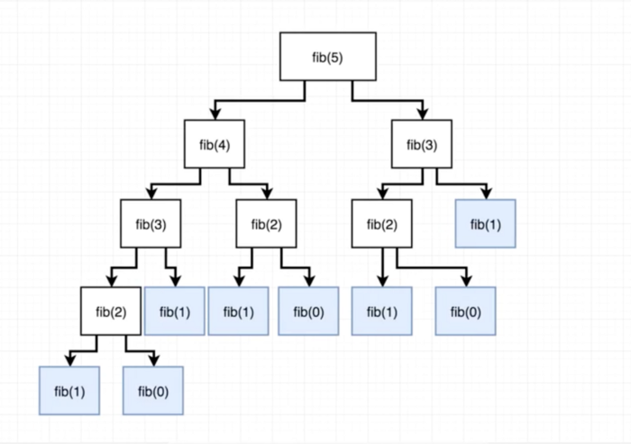

# Week 6 - Day 2
# More Sorting Algorithms

Lets continue to learn more sorting algorithms. 

## Insertion Sort

Insertion sort is similar to the algorithms we have studied before. However it follows a slightly different core idea. 

**Simple Steps:**


1. Get an array of unsorted numbers
2. Set a marker (i) for the sorted section after the first number in the list
3. Repeat steps 4 through 6 until the unsorted section is empty
4. Select the first unsorted number
5. Swap this number to the left until it arrives at the correct sorted position.
6. Advance the marker to the right one position.
7. Stop.

**Pseudo code:**

```
insertionSort(array)
  for i = 1 to array.size
    key = array[i]
    j = i - 1
      while array[j] > key and j > = 0
        array[j+1] = array[j]
        j = j–1
      end while 
      array[j+1] = key
  end for
end insertionSort
```

**Visualizer:**  [https://visualgo.net/bn/sorting](https://visualgo.net/bn/sorting) Select insertion sort on the navigation bar!

## Recursion

There are 2 primary approaches to solving problems when you have to iterate over some values or generate values in some pattern. 

- Iterative : Using for loops, while loops etc. Basically loops.
- Recursion

We write recursive algorithms using a **recursive function**. 

But what is a recursive function? 

in the simplest terms, a recursive function is a function that calls itself. 

Lets take a look at a simple example:

The following function will print all the numbers from the initial value of curr to 0.
```javascript
function  nums(curr){
    if(curr === 0){
        console.log(curr)
        return curr;
    }
    console.log(curr);
    return nums(curr - 1);
}
nums(10)
```

**Output:**

```
10
9
8
7
6
5
4
3
2
1
```

How does this work?

Recursion calls the same function `nums` with different values. It does this until `curr === 0` and then it returns the curr and exits. 

**Base Case:** `curr === 0` is our base case, all recursive algorithms must have a base case. These are values after which the recursion ends. 

How to think about recursion in a meaningful way ?

Lets say we are in a room and the room has 1 door with a number on it. You are looking for door with number 0 as it has a treasure in it. 

There is a number on the door `10`. 

You open that door and you see a door with the number `9`.

You keep opening doors that decrease in value until you get to the door with the number `0`. You open it and you get your treasure!

**Lets look at another example:**

This program adds numbers from the initial value to 0. 

```javascript
function sum(curr){
    if(curr === 0){
        return curr;
    }
    return curr + sum(curr-1);
}
sum(5)
```

**Output:**

```javascript
5 
5+4
5 + 4 + 3
5 + 4 + 3 + 2
5 + 4 + 3 + 2 + 1
5 + 4 + 3 + 2 + 1 + 0 = 15
```
15 is the final result and is the output.

Coming back to our door analogy:

1. We are in a room with doors but each room contains a decreasing number of gold coins. 
2. The first room has 5 coins so we pick those coins up and open the next door.
3. the second room has 4 coins so we pick those up and add it to our collection. Now we have 9 coins in total. 
4. We keep opening doors and collecting coins until we get to the door with 0 coins and we end our search.
5. At the end we have 5 + 4 + 3 + 2 + 1 = 15 coins!

**Lets look at one last example:**

This is for the Fibonacci series.

```javascript
function fibo(n){
    if(n < 2){
        return n;
    }
    return fibo(n-1) + fibo(n-2);
}
fibo(5)
```


(Diagram from Stephen Grider’s “The Coding Interview Bootcamp“ course on Udemy.com)

The tree gives us a great way to visualize recursion. The tree keeps growing until it reaches the base case.


