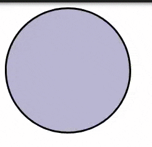
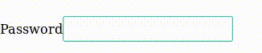
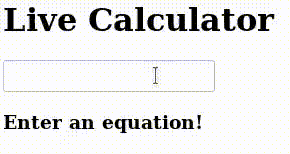

# Week 7 - Day 4

#### Coding Session 1

**SUBMISSION:**

- Pull the `cohort_1` repo
- Go to `practise/week_7/day_4/session1` 
- Make a react app with the name `firstname_lastname` with your first name and last name  
- Once you are done with the coding session create a new local branch called `firstname_lastname_week_7_day_4_session1` with your first name and last name. Push this branch to the remote repo. 
- Create a pull request for the branch you created with the Title `FirstName LastName Week 7 Day 4 Coding Session 1`. Add any relevant comments and the coding1 label to your pull request.

**React (Part 4)**

**NOTE:** Follow the instructions carefully and follow coding discipline

**NOTE2:** Indent your code correctly and stick to one kind of naming style

**NOTE3:** All components must be in different files and within a `Components`folder. CSS can be shared between components if desired. CSS modules must also be in your components folder. 

**NOTE4:** All static files like images must be in the public folder.

**NOTE5:** All compoenents files must have the same name as their compoenents. Eg: `App` must be in `App.js`.

**NOTE6:** You must only call `ReactDOM.render` once in your index.js file! 

Within the react App delete all files from the src folder and create your own files!

The objective here will be to create a few fun components in order to better understand state and listeners!

### FSD.W7.4.1_1
Create a component called `App` and render it from `index.js`. 

All the components we create in the next few steps should be children of `App`.

### FSD W7.4.1_2

Create a component called `DiscoBall`.

It should render a circular div of width `200px` and height `200px`.

When the mouse is moved over it, the background color of the div should change to a random color. 

It should look something like this:

###  FSD W7.4.1_3

Create a component called `PasswordInput`.

It should render the following:

1. Input box of type text.
2. Label for the above input box with the text `Password`.

When a user inputs some text into the inputbox, the current character should be shown but the rest should be replaced with the `•` symbol.

It should look like this:

 

### FSD W7.4.1_4

Create a component called `Calculator`.

It should render the following:

1. A header with the text `Live Calculator`
2. A Input box of type text.

Create a another component called `Display`.

It should render the following:

1. A `h3` tag.

The display component should be a child of the `Calculator` component.

When a mathematical question is typed into the inputbox, the display component should display the result of the equation. 

**Hint:** [https://developer.mozilla.org/en-US/docs/Web/JavaScript/Reference/Global_Objects/eval](https://developer.mozilla.org/en-US/docs/Web/JavaScript/Reference/Global_Objects/eval)

It should look like this:

 

    

