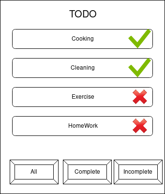
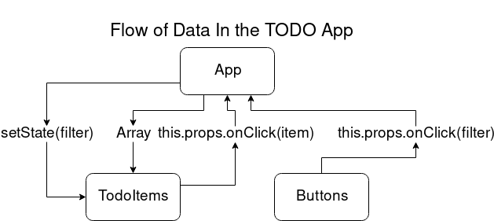

# Week 10 Day 1

### Introduction to Redux

**What is redux?**  

Redux is a predictable state container for ***any*** JavaScript application. For our purpose we are going to use Redux to manage a React Application. 


However, Redux has nothing to do with React JS, you can write applications that use Redux in plain JavaScript and direct DOM updates. Redux can also be used with any Front End or Backend framework like AngularJS, EmberJS, VueJS etc. 

**Why should my application use Redux?**

You may have noticed that writing large applications in plain react, handling state can become needlessly complicated. 

Take the example of a simple todo App:



Now lets look at the flow of data in the todo App:



We can already see that managing state is already getting very complicated. Even though we are working with a very small number of components that need to get updated. 

The problem is compounded by the fact that in order to pass state updates from a child component to a parent component or from a component to its sibling, you must pass it through a callback to a parent. 

Redux simplifies this entire spiderweb of passing state across your application. 


## Core parts of Redux

We will learn Redux by creating a simple counter application, first without react. Tomorrow we will tackle react + redux applications. 

1. To start, create a react app and delete all the files from the src folder. 

2. Create a file called index.js.

3. Type `npm install redux` to install redux. 


### The Redux Store

The solution to this is a single place to store and retrieve your applications state/data. Redux offers this in a place called the "store".


Documentation [https://redux.js.org/api/store](https://redux.js.org/api/store) 

Lets create a store in our index.js

```jsx
import { createStore } from 'redux'

const store  = createStore();
```


### Redux Actions and Action creators

Actions are used to send data from your App to the store, this is the only way for your app to send and receive data/modify state from the store. 

Actions are sent to the store via `store.dispatch()` function. Don't worry about this right now.

Actions are just regular JavaScript Object literals. 

However, every action **must** have a `type` property which describes the action that is being performed. 

The value of `type` is string and it is usually declared as a constant as it should never be modified. 

Lets create simple actions for our counter application. 

To start out with make a JavaScript file called `action.js` and write the code below there. 

```jsx
const INC_COUNTER = "INC_COUNTER"; // This is the type of the action

const action = {
	type : INC_COUNTER
}
```

**Action Creator:**

While declaring static actions could be fine, to send dynamic actions to the store you have to declare a **action creator**. 

An action creator is just a function that returns an action.

In our code lets substitute the `const action` with an action creator function. 

Our action creator will increment by the input argument `amount`.

I will also add a `DEC_COUNTER` action which should decrement our counter. 

```jsx
const INC_COUNTER = "INC_COUNTER"; // This is the type of the action

const DEC_COUNTER = "DEC_COUNTER";

const incrementCounter = (amount) =>{
	return {
		type : INC_COUNTER,
		amount
	}
}

const decrementCounter = (amount) =>{
	return {
		type : DEC_COUNTER,
		amount
	}
}
```
### Reducers

We have created actions but these don't do anything yet. **Reducers** are functions that specify how state changes in response to actions that are sent to the store.

From the react docs, "Remember that actions only describe what happened, but don't describe how the application's state changes."

This means actions don't do much else other than telling the store that we want to perform some change. Reducers actually implement the logic behind the actions. 

Reducers also store the initial state of your application.

To start out make file called reducer.js .

First we are going to write the initial state object literal. 

```jsx
const initialState = {
    count : 0
}
```

Next we are going to add an export the reducer function. 

```jsx
const INC_COUNTER = "INC_COUNTER"; // This is the type of the action

const DEC_COUNTER = "DEC_COUNTER"; // This is the type of the action


const initialState = {
    count : 0
}

const counter = (state = initialState, action) =>{
    switch(action.type){
        case INC_COUNTER:
            return {
                count : state.count  + action.amount
            }
        case DEC_COUNTER:
            return {
                count : state.count - action.amount
            }
        default : 
            return state
    }
}

export default counter; 
```

Our reducer is unaware of the action it may be receiving, it may receive 2 or more different types of actions and must handle them appropriator.

It is very common in Redux to use a switch statement to check the action type and return the new state accordingly. 

Again an important reminder that we are not directly modifying state, rather we are just returning `state+action.amount`

## Using store functions 

A Redux store has 3 main functions:

1. `getState()` which returns the current state tree of the application.
2. `dispatch(action)` which allows us to update state via actions.
3. `subscribe(listener)` which allows us register listener functions. The subscribed listener function is called any time an action modifies the state. 

You the `subcribe()` function also returns a function which you can call later to unregister the listener. 

Think of the subscriber function kind of like `addEventListener` and `removeEventListener`.

You can read about all 3 [here](https://redux.js.org/api/store#store).

Lets use these functions in our `index.js` file to get, modify and print the state to the browser console. 

```jsx
import { createStore } from 'redux';
import counter from './reducer';
import {incrementCounter, decrementCounter} from "./actions";

const store  = createStore(counter);

console.log(store.getState()); // Log the initial state

// This subscriber that logs the state to the console every time state changes
// The subsribe() function returns an function to also unsubscribe or unregister the listener

const logState = () =>{
    console.log(store.getState());
}

const unsubscribe = store.subscribe(logState);

//Here we dispatch actions to the store

//Here we use actions created by the action producers

store.dispatch(incrementCounter(10));
store.dispatch(incrementCounter(20));
store.dispatch(decrementCounter(5));
store.dispatch(decrementCounter(20));

//However we can also create actions manually since actions are just object literals
store.dispatch({
    type : "INC_COUNTER",
    amount : 100
});

unsubscribe() // Now we can stop listening for state updates 
```

You can see the code for this prject here [https://github.com/masai-school/full-stack-dev/tree/master/course/week_10/day_1/redux_counter](https://github.com/masai-school/full-stack-dev/tree/master/course/week_10/day_1/redux_counter)

## A visual representation of the Redux lifecycle:

If all of that was too confusing, this amazing GIF explains it better.


Source : https://github.com/reduxjs/redux/issues/653

## The three core principles of Redux

**Single Source of Truth:**

The store in redux is known as the single source of truth. This is because there is only one store in redux and it holds all the application state. Any state that need to be read in redux can only be done from the store.

**State is READ only**

You cannot modify state directly in Redux like you do within a React application using `setState()`.

According to the Redux Docs, "The only way to change the state is to emit an action, an object describing what happened."

Only modify state in Redux using actions and reducers!

**Changes in Redux are made with pure functions:**

Pure functions are functions that **do not** modify their arguments. Instead they create copies of the arguments and modify and change those copies to be returned later. 

Moreover for any given input, pure functions will always return the same value.


